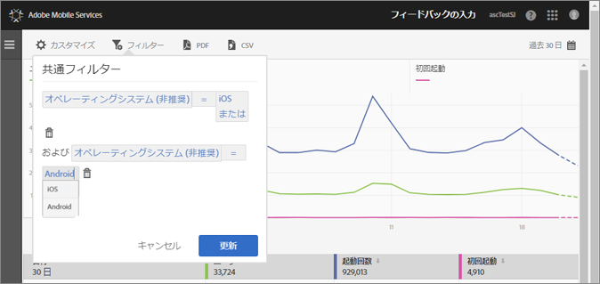

# 共通フィルターの追加 {#add-sticky-filter}

様々なレポートにわたるフィルターを作成して、すべてのモバイルレポートをまたいだ特定のセグメントのパフォーマンスを確認します。共通フィルターを定義すると、パス（画面遷移）レポート以外のすべてのレポートに適用されます。

次の例では、iOS オペレーティングシステムと Android オペレーティングシステムの共通フィルターを&#x200B;**[!UICONTROL ユーザーとセッション]**&#x200B;レポートに追加しますが、説明はどのレポートまたは指標にも当てはまります。

1. Adobe Mobile で、任意のレポートの上部にある&#x200B;**[!UICONTROL フィルター]**&#x200B;アイコンをクリックします。

   

1. 共通フィルターダイアログボックスで、「**[!UICONTROL ルールを追加]**」をクリックして&#x200B;**[!UICONTROL オペレーティングシステム]**&#x200B;を選択し、ドロップダウンリストから「**[!UICONTROL iOS]**」を選択します。

   Android をフィルターとして追加するには、この手順を繰り返します。

   

1. 「**[!UICONTROL AND]**」をクリックして&#x200B;**[!UICONTROL オペレーティングシステム]**&#x200B;を選択し、ドロップダウンリストから「**[!UICONTROL Android]**」を選択します。

   フィルターは次の例のようになります。

   

1. 「**[!UICONTROL 更新]**」および「**[!UICONTROL 実行]**」をクリックします。
