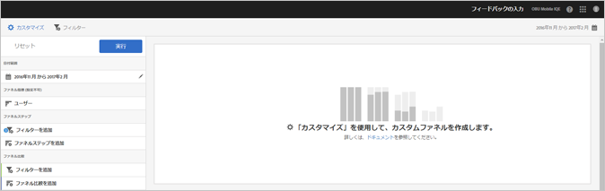
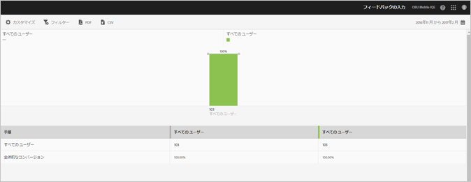

# Funnel report{#funnel}

**[!UICONTROL ファネル]レポートは、顧客がモバイルアプリの操作中にマーケティングキャンペーンを放棄した地点や、定義済みのコンバージョンパスからそれた地点を特定します。**&#x200B;また、**[!UICONTROL ファネル]レポートを使用して、様々なセグメントのアクションを比較できます。**

各ステップにおける顧客の意思決定を視覚的に捉えることで、意思決定が停止した場所、たどる傾向のあるパスおよび顧客がアプリを離れたタイミングを把握できます。

**[!UICONTROL ファネル]レポートを開く場合、カスタムファネルを作成する必要があります。** For more information, see [Customize Reports](/help/using/usage/reports-customize/reports-customize.md).

>[!TIP]
>
>カスタムファネルを保存するには、URLを設定してレポートを実行した後でURLを保存します。 この URL は、共有したり、ドキュメントに保存したりできます。

次に、このレポートの例を示します。

シンプルなファネルのデモをおこなうために、ここでは、3 つのファネルステップと 2 つのファネル比較を使用した設定を示します。デモのアプリでは、ユーザーはアイテム（写真など）を追加して、共有できます。

カスタマイズウィンドウには、ユーザーがアプリを起動し、アプリのギャラリーから写真を追加して、1 つまたは複数の写真、テキストメッセージ、電子メールなどをアプリからソーシャルメディアに共有したことを示すセクションがあります。ファネル比較では、iOS アプリと Android アプリのユーザーの間で、写真の追加と共有の水準を比較できます。

To generate the report, click **[!UICONTROL Run]**.

次に、生成されたレポートの例を示します。

最初のシリーズは、100％のユーザーがアプリを起動したことを示しています。2 つ目のシリーズは、ギャラリーから写真を追加したユーザーの割合は Android の方が高いことを示しています。3 つ目のシリーズは、写真を共有したユーザーが iOS では約半数、Android ではいないことを示しています。これは、アプリの問題が発生しており、調査が必要であることを示している可能性があります。

追加情報を表示するには、グラフの任意のバーの上にマウスポインターを置きます。

このレポートでは、次のオプションを設定できます。

* **[!UICONTROL 期間]**

   **[!UICONTROL カレンダー]アイコンをクリックしてカスタムの期間を選択するか、またはドロップダウンリストからあらかじめ設定されている期間を選択します。**
* **[!UICONTROL カスタマイズ]**

   Customize your reports by changing the **[!UICONTROL Show By]** options, adding metrics and filters, and adding additional series (metrics), and more. For more information, see [Customize Reports](/help/using/usage/reports-customize/reports-customize.md).
* **[!UICONTROL フィルター]**

   「**[!UICONTROL フィルター]」をクリックし、様々なレポートにわたるフィルターを作成して、すべてのモバイルレポートにおけるセグメントのパフォーマンスを確認します。**&#x200B;共通フィルターを定義すると、パス（画面遷移）レポート以外のすべてのレポートに適用できます。詳しくは、「共通フィルターの追 [加」を参照してください](/help/using/usage/reports-customize/t-sticky-filter.md)。
* **[!UICONTROL ダウンロード]**

   Click **[!UICONTROL PDF]** or **[!UICONTROL CSV]** to download or open documents and share with users who do not have access to Mobile Services or to use the file in presentations.