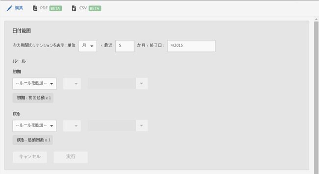

# リテンションレポート {#retention}

**[!UICONTROL リテンション]**&#x200B;レポート（以前の初回起動コホート）は、アプリを初めて起動した後の数ヶ月間にそのアプリを 1 回以上再度起動したユニークユーザー数を示すコホートレポートです。

このレポートには、デフォルトで、ユーザーがアプリを初めて起動した日時に基づいてユーザーのグループのリテンション率が表示されます。また、このレポートをカスタマイズして、初回起動以外の指標を使用したり、アクションを追加したりすることもできます。

コホートは、定義した期間に共通の特性またはエクスペリエンスを共有する人のグループです。**[!UICONTROL リテンション]**&#x200B;レポートは、特定の日、週または月にアプリをインストールしたユーザーの共通の特徴を抽出し、次の X 日、X 週または X 月にアプリを起動したユーザー数をグラフ化します。レポートには、訪問者がどの程度、アクティブまたは関与していた状態で定着したかが表示されます。

次に、このレポートの例を示します。

**[!UICONTROL M0]** 列には、2014 年 11 月に最初にアプリを起動した合計ユーザー数が表示されています。**[!UICONTROL M1]** 列には、2014 年 12 月にアプリを再度起動したユーザー数が表示されています。

日付範囲を変更したり、レポートのルールを編集したりするには、「**[!UICONTROL 編集]**」をクリックします。

レポートには、ライフサイクル指標などの任意の変数または指標（計算指標は除く）を入力できます。
