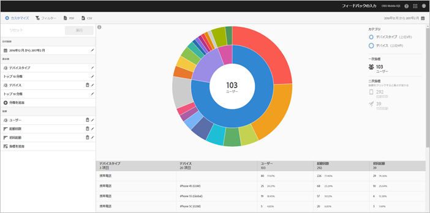

# 技術レポート {#technology}

**[!UICONTROL 技術]**&#x200B;レポートでは、アプリが使用されている様々なデバイスタイプ、オペレーティングシステム、オペレーティングシステムのバージョンおよび携帯電話会社を確認できます。

このレポートには、既存のデータのサンバーストチャートが表示されます。このレポートを使用して、ターゲティングすべきオーディエンスセグメント（訪問者の集まり）を見つけることができます。オーディエンスを作成して管理することは、セグメントを作成して使用することと似ていますが、例外は、オーディエンスを Experience Cloud で使用できるようになることです。

## ナビゲーションと使用方法 {#section_83CA60E1AE6245FEBCBFF3205615C4DF}

このビジュアライゼーションは、例えば、ベースレポートと分類を提供し、高さを使用して指標に焦点を当てており、指標間のパフォーマンスの違いを示します。 各リングは、リングのカテゴリ内のオーディエンスセグメントを表します。 共通フィルターの適用、指標の非表示、指標の表示など、オーディエンスに対してアクションを実行できます。

>[!TIP]
>
>この情報に加えて、サンバーストグラフの使用方法についてのチュートリアルを製品内で参照できます。チュートリアルを開始するには、レポートのタイトルバーの **[!UICONTROL 技術分類]** をクリックし、**[!UICONTROL カスタマイズ]** をクリックして、**[!UICONTROL i]** アイコンをクリックします。

サンバーストグラフはインタラクティブで、次のタスクを実行できます。

* グラフの任意の部分にマウスを移動すると、詳細情報が表示されます。
* **[!UICONTROL カレンダー]**&#x200B;アイコンをクリックして、期間を変更します。
* リングのスライスをクリックしてオーディエンスを選択し、ズームイン、オーディエンスの非表示、アプリ内メッセージや共通フィルターの作成などのアクションを実行できます。
* 右上隅で、**[!UICONTROL デバイスタイプ]** および **[!UICONTROL デバイス]** を選択して、デバイスおよびデバイスタイプに関する情報を表示します。

* 右側の二次指標をクリックして、ビジュアライゼーションに追加します。

   二次指標は、色、高さまたはその両方を使用して表示できます。

次の表に、標準レポートおよび Mobile Services での標準レポートのセット方法を示します。

| レポート | 母集団法 | 説明 |
|--- |--- |--- |
| デバイス | ライフサイクル指標 | 一般的な指標をデバイスタイプ別に表示します。 |
| オペレーティングシステム | 自動 | 一般的な指標をオペレーティングシステム別に表示します。 |
| オペレーティングシステムのバージョン | ライフサイクル指標 | 一般的な指標をオペレーティングシステムのバージョン別に表示します。 |
| 運送業者 | 自動 | 一般的な指標を通信事業者別に表示します。 |

>[!TIP]
>
>**[!UICONTROL 携帯電話会社]**&#x200B;レポートでは、Wi-fi ユーザーは `none` して報告されます。

## 分類と指標の追加 {#section_15833511E82648869E7B1EFC24EF7B82}

分類および二次指標を追加して、グラフ内の他のオーディエンスに対する各オーディエンスの高さを変更できます。

>[!IMPORTANT]
>
>サンバーストに追加するリングの数が増えると、処理に掛かる時間が長くなります。

分類および二次指標を追加するには、レポートのタイトルバーの **[!UICONTROL 技術分類]** をクリックし、**[!UICONTROL カスタマイズ]** をクリックします。

**[!UICONTROL 分類を追加]** または **[!UICONTROL 指標を追加]** をクリックすると、リストの前のアイテムと同じ名前の新しいアイテムが表示されます。新しく作成された分類または指標をクリックしてドロップダウンリストにアクセスし、そこから新しいアイテムを選択します。

## 共通フィルターの作成 {#section_B4E355CD1FE34E4C8ADC38139ED67FC8}

リングのスライスをクリックし、共通フィルターを作成するオーディエンスを選択して、**[!UICONTROL 共通フィルター]** をクリックします。このフィルターを使用すると、現在のフィルターを適用し、フィルターに基づいて新しいレポートを実行できます。

## レポートの共有 {#section_560DD5CED5144249B7E49461E2422100}

レポートを作成した後、設定を使用して、コピーおよび共有できるカスタム URL を作成します。
