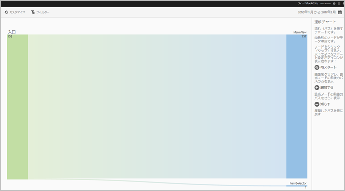
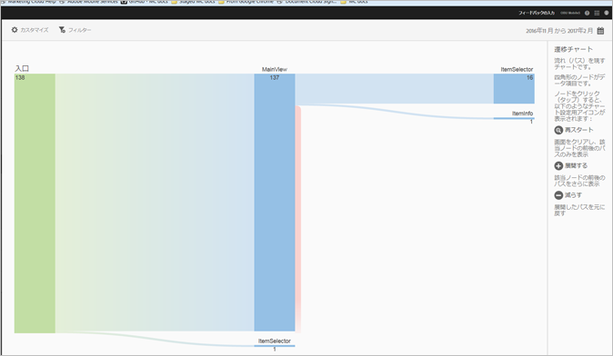
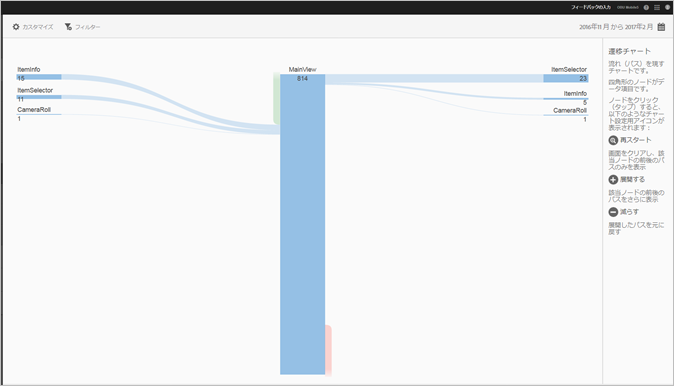
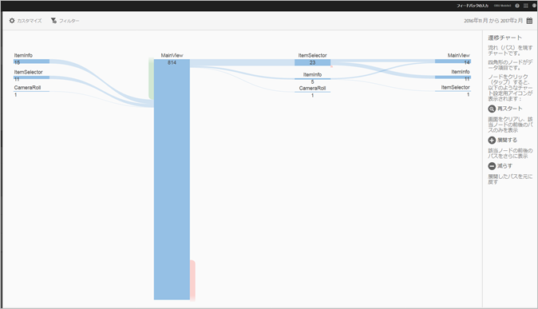

# パスレポートの表示 {#view-paths}

**[!UICONTROL ビューパス]**&#x200B;レポートはパス分析に基づいたもので、アプリ内の状態間の移行時にたどったパスを表す遷移チャートを表示します。

>[!TIP]
>
>**[!UICONTROL ビューパス]**&#x200B;と&#x200B;**[!UICONTROL ビューアクション]**&#x200B;レポートは両方ともパスレポートなので似ています。**[!UICONTROL ビューパス]**&#x200B;レポートでは、アプリにおけるユーザーの画面間の遷移を確認できます。**[!UICONTROL ビューアクション]**&#x200B;レポートは、ユーザーがアプリでおこなう一連のアクション（クリック、選択、サイズ変更などのイベント）を表示します。ファネルレポートを使用すると、ナビゲーションとアクションを 1 つのレポートに組み合わせることができます。詳しくは、「[ファネル](/help/using/usage/reports-funnel.md)」を参照してください。

ボックスのような形状をした各ノードは、ユーザーがアプリを操作したときにたどったパスの特定の状態を表しています。例えば、上の図では、一番上のノードは、アプリを起動してからメイン表示に移動したユーザーの数を表しています。

ノードをクリックすると、**[!UICONTROL フォーカス]** や **[!UICONTROL 展開]** など、チャートを変更するための追加のオプションが表示されます。例えば、一番上のノードの **[!UICONTROL MainView]** 状態をクリックすると、**[!UICONTROL フォーカス]**&#x200B;アイコンと&#x200B;**[!UICONTROL 展開]**&#x200B;アイコンが表示されます。

ビューを展開するには、**[!UICONTROL +]** アイコンをクリックして、ノードに入る、またはノードから出る追加のパスを表示します。下の図では、状態 1 はアプリを起動し、状態 2 はアプリのメインページを表示しています。状態 3 には、ユーザーがたどった次のパスが含まれています。

* カメラロールへのナビゲーション
* アイテムセレクターへのナビゲーション
* カメラへのナビゲーション
* 項目情報ページへのナビゲーション

をクリックすると、そのノードに焦点を当て、選択したノードに入るパス、および選択したノードから出るパスを表示します。下の図では、アプリのメイン表示を表示しているユーザーの前に、次のパスがあります。

* 項目情報
* 項目セレクター
* カメラロール
* カメラ

複数のノードに焦点を合わせたり、ノードを展開したりして、ユーザーがアプリ内でたどるパスを詳細に表示できます。以下に例を示します。

このレポートでは、次のオプションを設定できます。

* **[!UICONTROL 期間]**
**[!UICONTROL カレンダー]**&#x200B;アイコンをクリックしてカスタムの期間を選択するか、またはドロップダウンリストからあらかじめ設定されている期間を選択します。
* **[!UICONTROL カスタマイズ]**
「**[!UICONTROL 表示方法]**」オプションを変更したり、指標およびフィルターを追加したり、追加のシリーズ（指標）を追加したりして、レポートをカスタマイズします。詳しくは、「[レポートのカスタマイズ](/help/using/usage/reports-customize/reports-customize.md)」を参照してください。
* **[!UICONTROL フィルター]**
「**[!UICONTROL フィルター]**」をクリックし、様々なレポートにわたるフィルターを作成して、すべてのモバイルレポートにおけるセグメントのパフォーマンスを確認します。共通フィルターを定義すると、パス（画面遷移）レポート以外のすべてのレポートに適用できます。詳しくは、「[共通フィルターの追加](/help/using/usage/reports-customize/t-sticky-filter.md)」を参照してください。
* **[!UICONTROL ダウンロード]**
「**[!UICONTROL PDF]**」または「**[!UICONTROL CSV]**」をクリックして、ドキュメントをダウンロードするか開いて Mobile Services へのアクセス権を持たないユーザーと共有したり、プレゼンテーションで使用したりします。