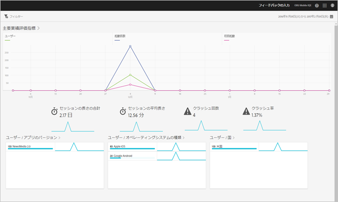

# 概要レポート{#overview}

{#eol}

概要レポートには、主要指標のスナップショットが表示されます。

次に、このレポートの例を示します。

レポートの日付範囲は、右上のカレンダーアイコンをクリックして変更できます。様々なレポートにわたる共通フィルターを作成して、すべてのモバイルレポートにおけるセグメントのパフォーマンスを確認します。共通フィルターの作成について詳しくは、「[共通フィルターの追加](/help/using/usage/reports-customize/t-sticky-filter.md)」を参照してください。

>[!TIP]
>
>アプリの作成時に、このレポートの主要指標を設定できます。詳しくは、「[アプリの設定](/help/using/c-manage-app-settings/c-mob-confg-app/c-mob-confg-app.md)」を参照してください。
