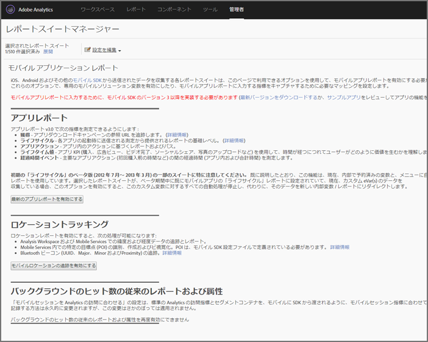

# Analytics {#analytics}

プロジェクトにライブラリを追加した後、アプリ内の任意の場所でAnalyticsメソッドの呼び出しを行うことができます。

>[!TIP]
>
>クラスにインポート `ADBMobile.h` してください。

## Analyticsでのモバイルアプリケーションレポートの有効化 {#section_F2F9234009184F20BA36B5CDE872B424}

コードを追加する前に、Analytics管理者に次の情報を入力して、モバイルアプリのライフサイクル追跡を有効にしてもらいます。 これにより、開発を開始する際に、レポートスイートで指標を取り込む準備が整います。

1. 管理ツール **[!UICONTROL /]** レポートスイートを開き **** 、モバイルレポートスイートを選択します。
1. 設定 **[!UICONTROL の編集]** / **[!UICONTROL モバイル管理]** / **[!UICONTROL モバイルアプリケーションレポート]**&#x200B;の順にクリックします。

   

1. 「最新のアプリレポートを **[!UICONTROL 有効にする]**」をクリックします。

   必要に応じて、「モバイルロケーショントラッキングを **[!UICONTROL 有効にする]** 」および「従来のレポートとアトリビューションを有効にする」をクリックしてバックグラウンドヒットを追跡することもでき ****&#x200B;ます。

   

これで、ライフサイクル指標を取り込む準備が整い、モバイルアプリケーションレポートがマーケティングレポートインターフェイスの **[!UICONTROL レポート]** メニューに表示されます。


### 新しいバージョン

定期的に、モバイルアプリケーションレポートの新しいバージョンがリリースされます。 新しいバージョンはレポートスイートに自動的に適用されないので、これらの手順を繰り返してアップグレードを実行する必要があります。 アプリに新しいExperience Cloud機能を追加するたびに、これらの手順を繰り返して最新の設定にすることをお勧めします。


## ライフサイクル指標 {#section_532702562A7A43809407C9A2CBA80E1E}

アプリ内のライフサイクル指標を収集するには、次の例に示すように、アプリがアクティブ化されたときのコールを追加します。


### default.jsのWinJS


```js
app.onactivated = function (args) { 
  if (args.detail.kind === activation.ActivationKind.launch) { 
   ... 
   // launched and resumed stuff  
   ADBMobile.Config.collectLifecycleData(); 
  } 
}; 
app.oncheckpoint = function (args) { 
  ADBMobile.Config.pauseCollectingLifecycleData(); 
}
```

### App.xaml.csのC#

```js
public App() 
{ 
    this.InitializeComponent(); 
    this.Resuming *= OnResuming; 
    this.Suspending *= OnSuspending; 
} 
protected override void OnLaunched(LaunchActivatedEventArgs e) 
{ 
    ... 
    ADBMobile.Config.CollectLifecycleData(); 
    ... 
} 
private void OnResuming(object sender, object e) 
{ 
    ... 
    ADBMobile.Config.CollectLifecycleData(); 
    ... 
} 
private void OnSuspending(object sender, SuspendingEventArgs e) 
{ 
    ... 
    ADBMobile.Config.PauseCollectingLifecycleData(); 
    ... 
}
```

### App.xaml.cpp内のC/CX

```js
App::App() 
{ 
 InitializeComponent(); 
 Resuming *= ref new EventHandler<Object ^>(this, &App::OnResuming); 
 Suspending *= ref new SuspendingEventHandler(this, &App::OnSuspending); 
} 
void App::OnResuming(Object ^sender, Object ^args) 
{ 
 ... 
 ADBMobile::Config::CollectLifecycleData(); 
 ... 
} 
void App::OnSuspending(Object^ sender, SuspendingEventArgs^ e) 
{ 
 ... 
 ADBMobile::Config::PauseCollectingLifecycleData(); 
 ... 
} 
void App::OnLaunched(Windows::ApplicationModel::Activation::LaunchActivatedEventArgs^ e) 
{ 
 ... 
 ADBMobile::Config::CollectLifecycleData(); 
 ... 
}
```

同じセッション `CollectLifecycleData()` で2回呼び出された場合、最初の呼び出しの後に毎回クラッシュが報告されます。 SDKは、アプリケーションがシャットダウンされたときに、終了が成功したことを示すフラグを設定します。 このフラグが設定されていない場合は、クラッシュ `CollectLifecyleData()` を報告します。


## event、prop、eVar {#section_76EA6F5611184C5CAE6E62956D84D7B6}


ADBMobileクラスおよびメソッドリファレンスを参照している場合 [](/help/windows-appstore/c-configuration/methods.md)、イベント、eVar、prop、ヒーラーおよびリストを設定する場所をお考えの方は、おそらくお考えでしょう。 バージョン4では、これらのタイプの変数を直接アプリで割り当てることはできなくなりました。 代わりに、SDK は、コンテキストデータと処理ルールを使用して、レポート用にアプリデータを Analytics 変数へとマッピングします。

処理ルールには、次のようないくつかの利点があります。

* アプリストアにアップデートを送信しなくてもデータマッピングを変更できます。
* データには、レポートスイートに固有の変数を設定する代わりに、意味のある名前を付けることができます。
* 追加のデータを送信しても、影響はほとんどありません。これらの値は、処理ルールを使用してマッピングされるまで、レポートに表示されません。

変数に直接割り当てた値は、代わりにコンテキストデータに追加する必要があります。


## 処理ルール {#section_66EE762EEA5E4728864166201617DEBF}

処理ルールは、コンテキストデータ変数で送信するデータをeVar、propおよびその他の変数にコピーしてレポートするために使用します。

[処理ルールトレーニング](https://tv.adobe.com/embed/1181/16506/) @ Summit 2013

[処理ルールの概要](https://docs.adobe.com/content/help/ja-JP/analytics/admin/admin-tools/processing-rules/processing-rules.html)

[処理ルールを使用するための承認の取得](https://helpx.adobe.com/analytics/kb/processing-rules-authorization.html)

論理的な順序を維持するのに役立つため、コンテキストデータ変数を「名前空間」を使用してグループ化することをお勧めします。 例えば、製品に関する情報を収集する場合、次の変数を定義できます。

```js
"product.type":"hat" 
"product.team":"mariners" 
"product.color":"blue"
```

コンテキストデータ変数は、処理ルールインターフェイスではアルファベット順に並べ替えられるので、名前空間を使用すると、同じ名前空間内の変数をすばやく確認できます。

また、evarまたはprop番号を使用してコンテキストデータキーに名前を付ける方もいらっしゃいます。

```js
"eVar1":"jimbo"
```

This might make it *slightly* easier when you perform the one time mapping in processing rules, but you lose readability during debugging and future code updates can be more difficult. 代わりに、キーと値にはわかりやすい名前を使用することを強くお勧めします。

```js
"username":"jimbo"
```

カウンターイベントを定義するコンテキスト変数を「1」の値に設定します。

```js
"logon":"1"
```

増分イベントを定義するコンテキストデータ変数には、次の値を指定できます。

```js
"levels completed":"6"
```

>[!NOTE]
>
>アドビは名前空間「`a.`」を予約します。この小さな制限に加えて、コンテキストデータ変数は、競合を回避するために、ログイン会社内で一意である必要があります。

## products 変数 {#section_AFBA36F3718C44D29AF81B9E1056A1B4}

モバイルSDK *`products`* に設定するには、特別な構文を使用する必要があります。 「 [products Variable](/help/windows-appstore/analytics/products/products.md)」を参照してください。

## （オプション）オフライン追跡の有効化 {#section_955B2A03EB854742BDFC4A0A3C287009}

デバイスがオフラインの場合にヒットを保存するには、 [ADBMobileConfig.json設定でオフライン追跡を有効にします](/help/windows-appstore/c-configuration/methods.md)。 オフライン追跡を有効にする前に、設定ファイルのリファレンスに記載されているタイムスタンプの要件に注意してください。

## 位置情報と目標地点 {#section_BAD34A8DD013454DB355121316BD7FD4}

地域 — 位置情報を使用すると、位置データ（緯度/経度）と事前に定義された目標地点を測定できます。 各 `TrackLocation` 呼び出しは次を送信します。

* 緯度/経度、POI( `ADBMobileConfig.json` 設定ファイルで定義されたPOI内の場合) これらは、自動レポートのためにモバイルソリューション変数に渡されます。
* 中心からの距離と、コンテキストデータとして渡される精度。 処理ルールを使用したキャプチャ。

場所を追跡するには：

```js
var ADB = ADBMobile; 
ADB.Analytics.trackLocation(37.75345, -122.33207, null);
```

設定ファイルで次のPOIが定義されている場合： `ADBMobileConfig.json`

```js
"poi" : [ 
            ["San Francisco",37.757144,-122.44812,7000], 
        ]
```

デバイスの位置が定義した点の半径7000メートル以内であると判断された場合、ヒットと共に「San Francisco」という値を持つ `a.loc.poi` コンテキストデータ変数が送信され `TrackLocation` ます。 An `a.loc.dist` context variable is sent with the distance in meters from the defined coordinates.

## Lifetime value {#section_D2C6971545BA4D639FBE07F13EF08895}

ライフタイム値を使用して、各ユーザーのライフタイム値を測定し、ターゲットを設定できます。`TrackLifetimeValueIncrease` で値を送信するたびに、その値が既存の値に追加されます。ライフタイム値はデバイス上に保存され、`GetLifetimeValue` を呼び出していつでも取得することができます。この値を使用して、全期間の購入、広告ビュー、ビデオ完了、ソーシャル共有、写真のアップロードなどを保存できます。

```js
// Lifetime Value Example 
var ADB = ADBMobile; 
var purchasePrice = 39.95; 
var cdata = new Windows.Foundation.Collections.PropertySet(); 
cdata["ItemPurchaseEvent"] = "ItemPurchaseEvent"; 
cdata["PurchaseItem"] = "Item453"; 
cdata["PurchasePrice"] = purchasePrice; 
ADB.Analytics.trackLifetimeValueIncrease(purchasePrice, cdata);
```

## 時間計測アクション {#section_7FF8B6A913A0460EAA4CAE835E32D8C1}

時間計測アクションを使用すると、アプリ内時間と、開始からアクションの終了までの合計時間を計測できます。 SDKは、セッションの時間と、アクションが完了するまでに要する合計時間（セッション間）を計算します。 これは、購入、パスレベル、チェックアウトフローなどに合わせて比較するセグメントを定義するために使用できます。

* 開始から終了までのアプリ内の合計秒数 - クロスセッション
* 開始から終了までの合計秒数（時刻）

```js
// Timed Action Start Example 
var ADB = ADBMobile; 
var cdata = new Windows.Foundation.Collections.PropertySet(); 
cdata["ExperienceName"] = experience; 
ADB.Analytics.trackTimedActionStart("TimeUntilPurchase", cdata);
```

```js
// Timed Action Update Example 
var ADB = ADBMobile; 
var cdataUpdate = new Windows.Foundation.Collections.PropertySet(); 
cdataUpdate["ImageLiked"] = imageName; 
ADB.Analytics.trackTimedActionStart("TimeUntilPurchase", cdata); 
```

```js
// Timed Action End Example 
var ADB = ADBMobile; 
ADB.Analytics.trackTimedActionEnd("TimeUntilPurchase");
```
