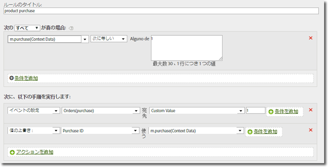

# Products variable{#products-variable}

products 変数は、処理ルールを使用して設定することができません。モバイル SDK では、コンテキストデータパラメーター内で特殊な構文を使用して、products をサーバー呼び出しで直接設定する必要があります。

To set the *`products`* variable, set a context data key to `"&&products"`, and set the value using the syntax defined for the *`products`*:

```js
cdata["&&products"] = "Category;Product;Quantity;Price[,Category;Product;Quantity;Price]";
```

以下に例を示します。

```js
//create a context data dictionary 
var cdata = new Windows.Foundation.Collections.PropertySet(); 
 
// add products, a purchase id, a purchase context data key, and any other data you want to collect. 
// Note the special syntax for products 
cdata["&&products"] = ";Running Shoes;1;69.95,;Running Socks;10;29.99"; 
cdata["m.purchaseid"] = "1234567890"; 
cdata["m.purchase"] = "1"; 
 
var ADB = ADBMobile; 
// send the tracking call - use either a trackAction or TrackState call. 
// trackAction example: 
ADB.Analytics.trackAction("purchase", cdata); 
// trackState example: 
ADB.Analytics.trackState("Order Confirmation", cdata);
```

*`products`* がイメージリクエストに直接設定され、その他の変数がコンテキストデータとして設定されます。 すべてのコンテキストデータ変数は、処理ルールを使用してマッピングする必要があります。



You do not need to map the  variable using processing rules since it is set directly on the image request by the SDK.*`products`*
