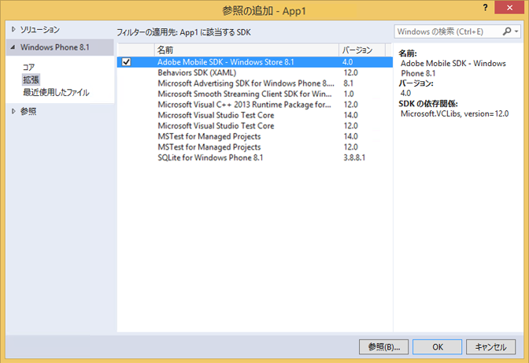

# Windows Visual Studio extensions for Experience Cloud Solutions 4.x SDK {#windows-visual-studio-extensions-for-experience-cloud-solutions-x-sdk}

この拡張機能を使用すると、Experience Cloud ソリューション 4.x Windows SDK の参照を簡単にプロジェクトに追加できるようになります。

## GitHubからのライブラリのインストール {#section_F55DB6241EF1475286C05FEAEBF996A3}

1. [GitHub](https://github.com/Adobe-Marketing-Cloud/mobile-services/releases) から Windows Universal SDK をダウンロードします。
1. ダウンロードしたファイルをローカルに解凍します。
1. ADBMobileWindowsstoreSisix. vssixまたはADBMobileWindowSponEvsix. v6ファイルをダブルクリックして、インストーラーを開きます。

1. **[!UICONTROL 「グローバル場所」を選択]** し、ライブラリをインストールします。

## Add references to your project {#section_00C14FE9243D4330BE1F4BB56FCF08B1}

1. Windows 8.1 または Windows Phone 8.1 プロジェクトを開きます。
1. Reference Managerダイアログボックスを開きます。

   

1. Windows8.1またはWindows Phone8.1の **[!UICONTROL 「拡張機能]** 」タブで、「 **[UACROL Adobe Mobile SDK]**」を検索して選択します。
1. 「**[!UICONTROL OK]」をクリックして保存します。**

   Adobe Mobile SDKがプロジェクトに追加され、まだ追加されていない場合は **[、UACROL Microsoft Visual C++ランタイム]** パッケージも追加されます。

1. Configuration Managerで、プラットフォームタイプを選択し、アプリのテストを開始します。

